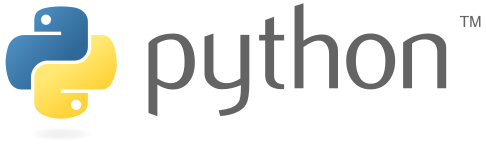
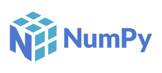

# Hi 👋🏼, I am Denis Kiplimo!

Welcome to my GitHub profile 🙏🏼

---

## About Me:

### Software Developer | Cybersecurity Enthusiast

*I create algorithms and models that help computers learn from data and make forecasts, resulting in valuable business insights. Additionally, I am passionate about ensuring the security of these systems through cutting-edge cybersecurity practices.*

---

### Profile Summary

As a dedicated software developer with a strong background in financial modeling, valuation analysis, and business intelligence, I am driven by a passion for leveraging technology to tackle complex challenges. My diverse skill set includes expertise in statistics, mathematics, data science, and cybersecurity, complemented by hands-on experience in software development.

**Applied statistics with computing Expertise:**
With a focus on actuarial science, I have successfully completed the Financial Modeling and Valuation Analyst (FMVA) certification, demonstrating proficiency in financial modeling, business forecasting, and valuation techniques. My analytical skills extend to risk assessment, ensuring informed decision-making in financial contexts. I have worked in a financial institution with experience in bank operations, insurance, money transfers, audit, account management, marketing, and digitization.

**Data Science and Business Intelligence:**
In addition to my actuarial background, I bring a wealth of experience in data science and business intelligence. I have applied advanced statistical methods, machine learning, and natural language processing (NLP) to derive meaningful insights from data. My portfolio showcases projects that demonstrate my ability to harness data for strategic decision-making. I also possess a certification in Business Intelligence and Data Analysis (BIDA).

**Cybersecurity and Continuous Learning:**
I am deeply invested in cybersecurity, staying updated with the latest trends and technologies in this crucial field. My commitment to personal and professional growth is reflected in my proactive approach to acquiring new skills and exploring emerging technologies like OpenAI's advancements.

**Collaboration and Impact:**
I am dedicated to making a meaningful impact at the intersection of actuarial science, data science, cybersecurity, and software development. My GitHub portfolio showcases my contributions and projects, demonstrating my commitment to excellence. If you share a vision for collaborative innovation and lasting impact, I invite you to reach out for potential collaboration at 📫 deniskiplimo816@gmail.com.

Let's embark on a journey of mutual growth and professional advancement.

#### Professional Links:

---

## Domains of Interests & Expertise

:comet: Applied statistics with computing 
:comet: Cybersecurity  
:comet: Machine Learning  
:comet: Data Science  
:comet: Business Intelligence  
:comet: Cloud Computing  
:comet: OpenAI Projects (e.g., [OpenAI API Integration](https://openai.com/api))  
:comet: Software Development  

---

## Skills 

### Languages, Libraries, Tools, and Frameworks:

    
    
    
    
    
    
    
    
    
    
   

---

### 💻 Programming

---

### 💾 Database Management

### 📷 Image Processing

### 🤖 AI/ML Applications 

 
 
 
 
 
 

---

### 📊 Data Science and ML

)

---

## [Cybersecurity](https://en.wikipedia.org/wiki/Computer_security)

### Securing Digital Assets

- Proficient in Ethical Hacking, Penetration Testing, and Cybersecurity practices
- Understanding of how to protect systems and data from threats, attacks, and vulnerabilities
- Knowledge of cryptography, network security, and secure coding practices

---

### Projects

[Check out my portfolio projects here!](http://arestotech.great-site.net/?i=1)

---

### Connect with Me

📫 Email: deniskiplimo816@gmail.com  
💼 LinkedIn: [Denis Kiplimo](https://www.linkedin.com/in/denis-kiplimo-2222a910a/)  
🌐 Portfolio: [arestotech.great-site.net](http://arestotech.great-site.net/?i=1)

---

**Let's collaborate to bring ideas to life!**